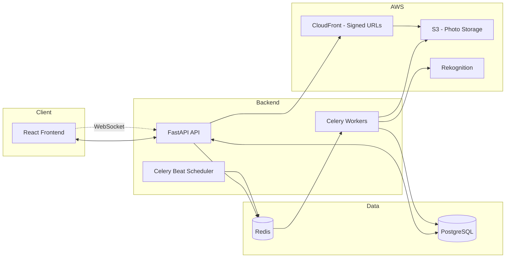
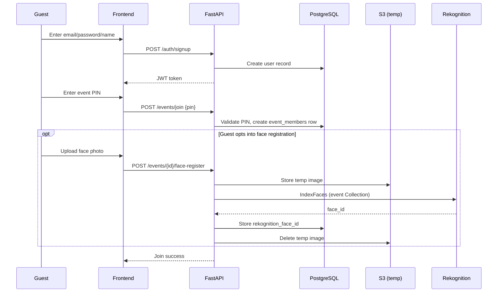
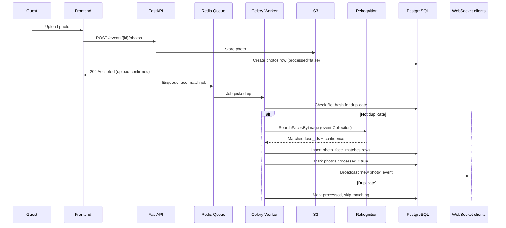
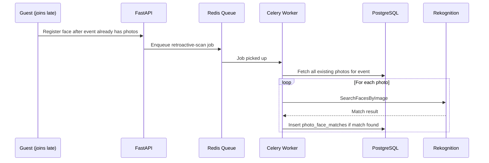
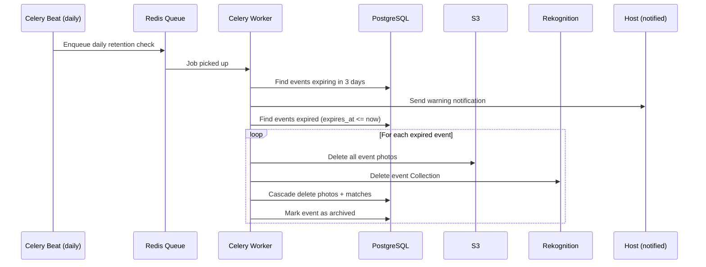
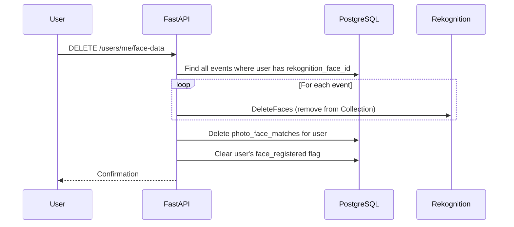
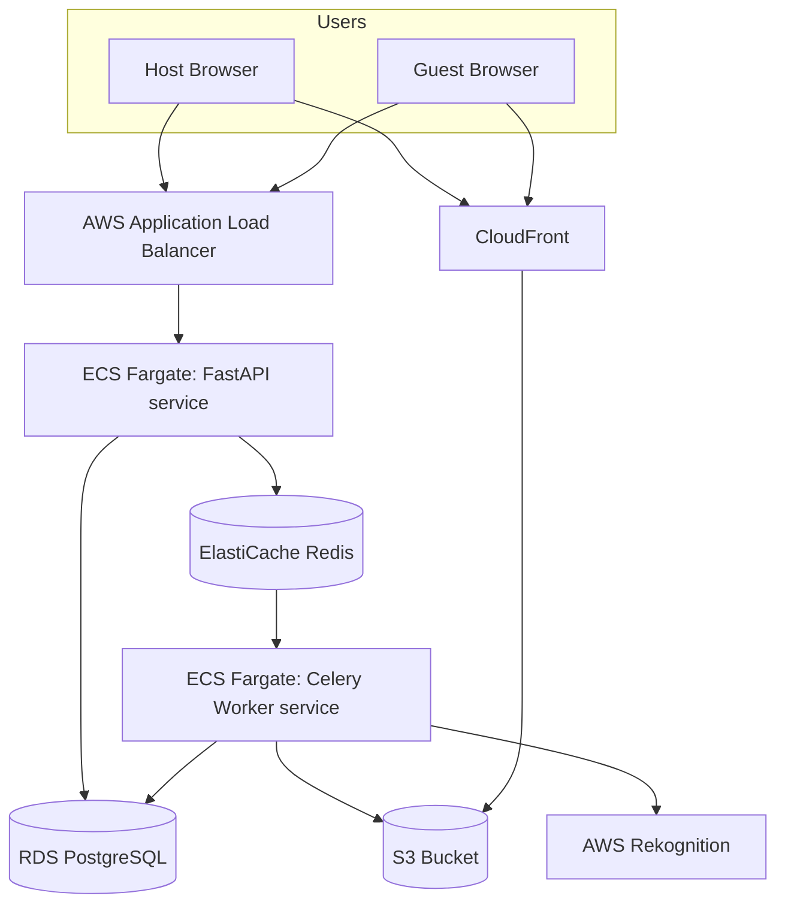

# Architecture & Workflow Document
## EventSnap — Event Photo Sharing Platform

This document shows how components interact across the platform's key flows. Diagrams are in Mermaid syntax — most Markdown viewers (GitHub, VS Code, Antigravity) render these directly.

---

## 1. High-Level Component Diagram

---

## 2. Sequence: Guest Signup + Join Event with Face Registration

---

## 3. Sequence: Photo Upload + Async Face Matching

---

## 4. Sequence: Late Join Retroactive Scan

---

## 5. Sequence: Retention Cleanup

---

## 6. Sequence: User-Initiated Face Data Deletion

---

## 7. Deployment Topology

---

## 8. Build Order (maps to PRD milestones)

1. **M1** — Diagrams §2 minus face registration (auth + PIN join only)
2. **M2** — Diagram §3 minus Rekognition steps (upload + gallery, no matching)
3. **M3** — Full diagram §3 with Rekognition + diagram §2's face registration
4. **M4** — Diagrams §5 and §6 (retention + deletion)
5. **M5** — WebSocket broadcast portion of §3 + confirm/reject UI (F8)
6. **M6** — Diagram §7 (deployment)
